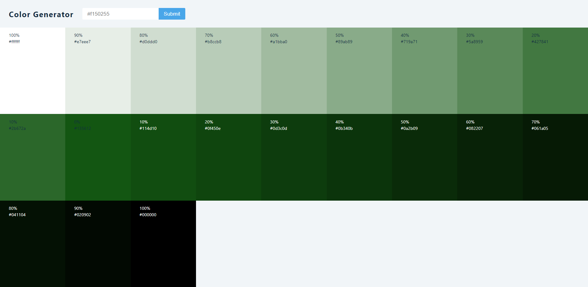

## Corresponding Tutorial Topics

#### useState

1. Birthday Reminder

#### useEffect and Conditional Rendering

2. Tours

3. Reviews

4. Questions

5. Menu

6. Tabs

7. Stripe Menu

8. Slider

#### Forms

9. Lorem Ipsum Generator

10. Color Shades Generator

11. Grocery Bud

#### useRef

12. Navbar

#### useContext

13. Modal and Sidebar

#### useReducer and useContext

14. Cart

#### React Router and useCallback

15. Cocktails

